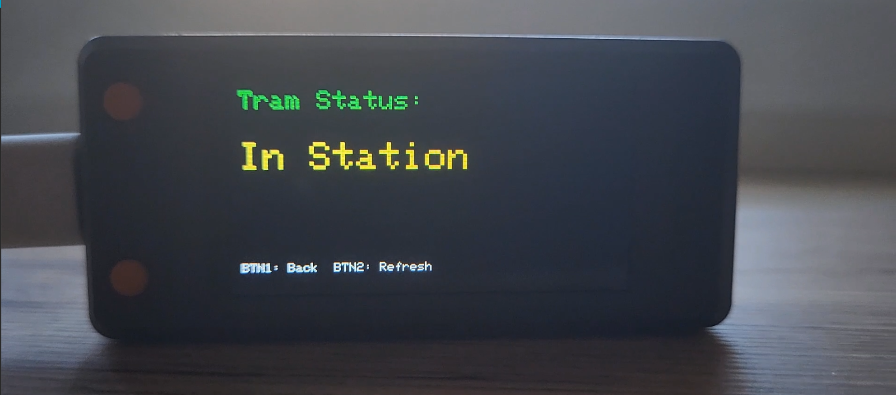
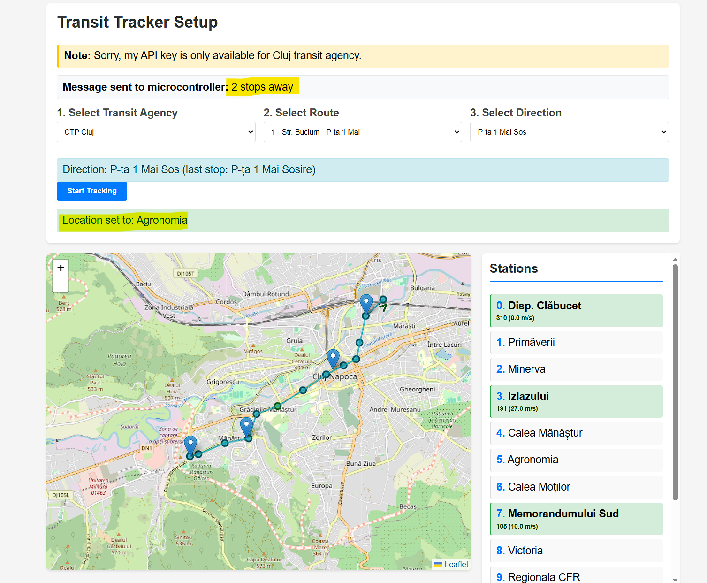

# YouShouldGo
Java Spring Boot app to allow a user to know when to leave, to catch his bus, with IoT integration (Based on Tranzy's API)
I recommend using the Platform.io Visual Studio extension to manage the libraries and flashing the microcontroller. Tested on t-display-s3 esp32 development board.
You can try it ourself at https://youshouldgo.onrender.com/
Link to demo video: https://drive.google.com/file/d/1rAULeCVtJAD0p6ob4Yf_5ieK7WKnjSjT/view?usp=sharing

